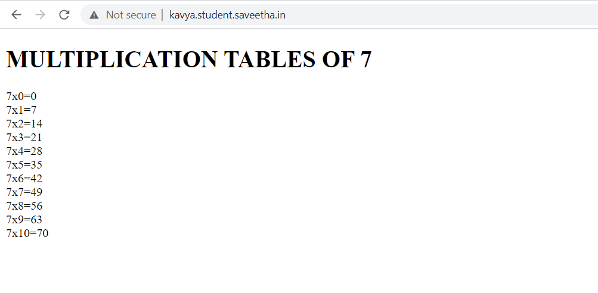

# Developing a Simple Webserver
## AIM:
To develop a simple webserver to serve html pages.

## DESIGN STEPS:
### Step 1: 
HTML content creation
### Step 2:
Design of webserver workflow
### Step 3:
Implementation using Python code
### Step 4:
Serving the HTML pages.
### Step 5:
Testing the webserver

## PROGRAM:
### webpage.py
```
from http.server import HTTPServer, BaseHTTPRequestHandler
content = """
<!DOCTYPE html>
<html>
<head>
<title>webserver</title>
</head>
<body>
<h1>MULTIPLICATION TABLES OF 11</h1>
11x0=0<br>
11x1=11<br>
11x2=22<br>
11x3=33<br>
11x4=44<br>
11x5=55<br>
11x6=66<br>
11x7=77<br>
11x8=88<br>
11x9=99<br>
11x10=110<br>
</body>
</html>
"""
class myhandler(BaseHTTPRequestHandler):
    def do_GET(self):
        print("request received")
        self.send_response(200)
        self.send_header('content-type', 'text/html; charset=utf-8')
        self.end_headers()
        self.wfile.write(content.encode())
server_address = ('',80)
httpd = HTTPServer(server_address,myhandler)
print("webserver is running")
httpd.serve_forever()
```


## OUTPUT:


### code validator report:


## RESULT:
Thus the simple webserver is developed to serve html pages and is hosted in the url http://kavya.student.saveetha.in/. HTML code is validated.
